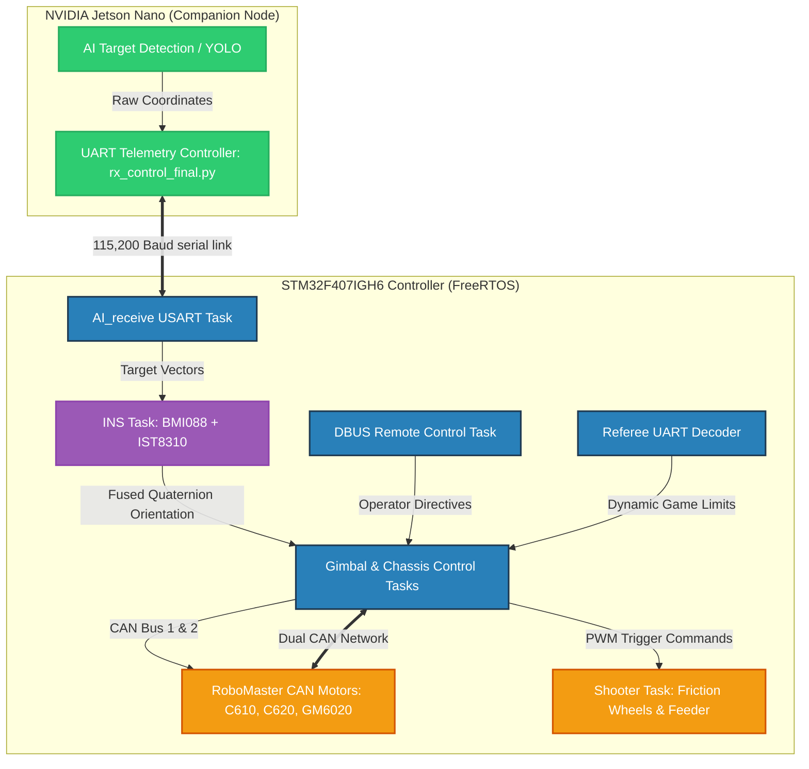
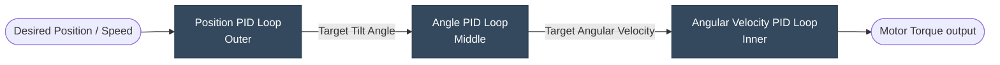
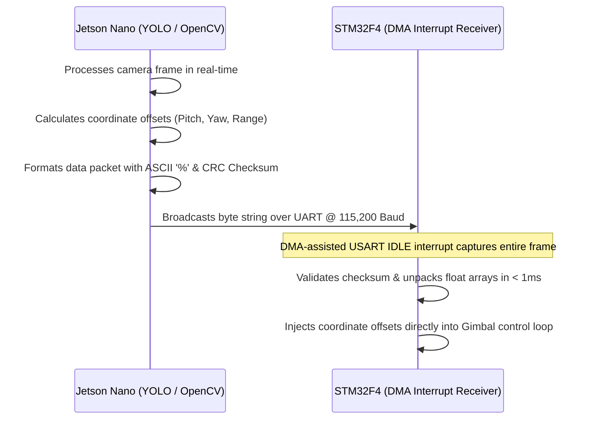

# Robot Control System 🤖🎮

[](https://github.com/MahadiAlif/Robot-Control-System/tree/main/firmware)
[](https://github.com/MahadiAlif/Robot-Control-System/tree/main/jetson_uart)
[](https://github.com/MahadiAlif/Robot-Control-System)
[](https://github.com/MahadiAlif/Robot-Control-System)

A high-performance, developer-grade robotics control platform coordinating an onboard **STM32F407IGH6** real-time microcontroller with an **NVIDIA Jetson Nano** companion processor. The system utilizes **FreeRTOS** C firmware to control three diverse robotic configurations (**Standard**, **Sentry**, and **Self-Balancing** robots) while processing real-time, low-latency computer vision target tracking over a high-speed UART telemetry link.

---

## 🛠️ System Architecture & Signal Topology

This architecture separates high-speed, deterministic control loops (STM32) from computational computer vision and deep learning tasks (Jetson Nano), communicating over an optimized serial protocol.



---

## 📂 Repository Breakdown

The repository is organized for modularity, readability, and clean compilation:

```
Robot-Control-System/
├── .gitignore                      # Workspace clean rules (excludes Keil outputs & Python caches)
├── README.md                       # Overhauled, interview-ready developer manual
├── firmware/                       # STM32 CubeMX & Keil MDK-ARM C Firmware
│   ├── Src/ & Inc/                 # Core HAL main initialization routines
│   ├── Drivers/ & Middlewares/     # STM32 HAL Drivers & FreeRTOS Kernel libraries
│   ├── MDK-ARM/                    # Keil MDK-ARM workspace & compilation config (can.uvprojx)
│   ├── application/                # Real-time multi-threaded robot behaviors
│   │   ├── INS_task.c/h            # 1 kHz Inertial Navigation & AHRS fusion thread
│   │   ├── calibrate_task.c/h      # Sensor calibration and thermal monitoring
│   │   ├── chassis_task.c/h        # Chassis locomotion kinematics (Standard, Sentry, Balancing)
│   │   ├── gimbal_task.c/h         # Dynamic gimbal stabilize and target tracking
│   │   ├── shooting_task.c/h       # Projectile feeder & shooter thermal safety checks
│   │   ├── detect_task.c/h         # Hardware online diagnostics and fault detection
│   │   ├── referee.c/h             # Decodes referee power limits & game boundaries
│   │   └── AI_receive.c/h          # Captures and validates Jetson tracking vectors
│   ├── bsp/                        # Board Support Package low-level drivers
│   │   ├── bsp_can.c/h             # Dual CAN Bus transmit/receive handlers
│   │   ├── bsp_spi.c/h             # High-speed SPI for BMI088 communication
│   │   ├── bsp_usart.c/h           # DMA-assisted UART interface for RC & telemetry
│   │   └── bsp_delay.c/h           # Hardware delay timers for microsecond resolution
│   └── components/                 # Sensor drivers, algorithms, and libraries
│       ├── algorithm/              # PID controllers & sensor fusion math
│       ├── controller/             # Posture stabilization & chassis mixing
│       ├── devices/                # Driver layers for BMI088 & IST8310
│       └── support/                # FIFO circular buffers & CRC validation
├── jetson_uart/                    # Companion node scripts on Jetson Nano
│   ├── requirements.txt            # Python serial communication requirements
│   ├── rx_control_final.py         # AI CV packet decoding, scaling, and transmission
│   └── uart_communication.py       # Basic loopback check and local debugging
├── docs/                           # Hardware specification libraries
│   ├── datasheets/                 # STM32 manual & Jetson board spec sheet
│   ├── manuals/                    # RoboMaster Board Type C user manual
│   └── schematics/                 # Gyroscope & mainboard hardware layouts
└── media/                          # Physical workspace screenshots
```

---

## ⚡ Real-Time Operating System (FreeRTOS) Task Architecture

To prevent scheduling latency and race conditions, the STM32 firmware organizes behaviors into deterministic, priority-allocated tasks scheduled via FreeRTOS:

| Task Name | Priority | Core Implementation File | Exec. Frequency | Purpose & Safety Features |
| :--- | :---: | :--- | :---: | :--- |
| **INS Task** | `Real-Time` | [INS_task.c](firmware/application/INS_task.c) | **1,000 Hz** | Fuses 6-axis BMI088 IMU + IST8310 Magnetometer readings using quaternion-based Mahony filter. Corrects thermal drift. |
| **Calibrate Task** | `High` | [calibrate_task.c](firmware/application/calibrate_task.c) | Dynamic / 100 Hz | Monitors sensor temperature. Activates PWM IMU heater to maintain constant $45^\circ\text{C}$ to combat bias shift. |
| **Chassis Task** | `High` | [chassis_task.c](firmware/application/chassis_task.c) | **500 Hz** | Resolves kinetic motor velocities. Adapts automatically to Sentry (rail), Standard (Mecanum/omni), and Balancing (inverted pendulum) models. |
| **Gimbal Task** | `High` | [gimbal_task.c](firmware/application/gimbal_task.c) | **500 Hz** | Controls stabilizing yaw & pitch GM6020 motors. Implements cascade feedback + feedforward gyro isolation. |
| **Shoot Task** | `Medium` | [shooting_task.c](firmware/application/shooting_task.c) | 200 Hz | Operates friction wheels and feeder motor. Checks referee power and heat boundaries to prevent over-power penalties. |
| **AI Receive** | `Medium` | [AI_receive.c](firmware/application/AI_receive.c) | Interrupt-driven | Parses UART tracking telemetry from the Jetson. Extracts coordinate offsets and updates target tracking buffers. |
| **Detect Task** | `Low` | [detect_task.c](firmware/application/detect_task.c) | 50 Hz | System safety watchdog. Monitors CAN frame intervals and triggers offline safety fallbacks if communication is lost. |
| **Referee Task** | `Low` | [referee.c](firmware/application/referee.c) | 100 Hz | Decodes game engine telemetry over serial, monitoring voltage, current, and dynamic turret temperature constraints. |

---

## 🎯 Control Loop Theory & Locomotion Kinematics

### 1. Inverted Pendulum Self-Balancing Chassis
The self-balancing robot uses a **Triple Cascade PID Loop** to control a highly unstable, two-wheeled chassis:



* **Position/Velocity Control (Outer Loop)**: Regulates the robot's linear velocity to zero, maintaining stability in place or following driver commands.
* **Angle Control (Middle Loop)**: Fuses accelerometer data to calculate the current tilt offset from vertical and outputs target angular velocities.
* **Angular Velocity Control (Inner Loop)**: Focuses gyroscope integration to instantly correct rapid rotational shifts, running at 1 kHz to prevent the robot from falling.

### 2. Mecanum/Omni-Wheel Locomotion
For Standard and Sentry configurations, the chassis task implements omnidirectional kinematics:

$$\begin{aligned}
v_{FL} &= v_x - v_y - \omega(R_x + R_y) \\
v_{FR} &= v_x + v_y + \omega(R_x + R_y) \\
v_{BL} &= v_x + v_y - \omega(R_x + R_y) \\
v_{BR} &= v_x - v_y + \omega(R_x + R_y)
\end{aligned}$$

Where $v_x, v_y$ are linear velocities, $\omega$ is the yaw rate, and $R_x, R_y$ are the geometric offsets from the center of mass to the wheels.

---

## 📡 Low-Latency Telemetry & Vision Parser

To achieve tight target tracking during target-tracking, the serial parser between the Jetson Nano and STM32 is optimized for speed and reliability:



* **Zero-Overhead DMA Receiver**: By binding the UART controller to direct memory access (DMA) channels on the STM32, data packets are written directly into a circular ring buffer without triggering standard byte-by-byte CPU interrupts.
* **Efficient Packet Framing**: Formatted as `%pitch_offset yaw_offset target_range checksum\n` to minimize transmission size and eliminate parser stalls.
* **Hardware-Accelerated Decoupling**: Target coordinate offsets are passed immediately to the gimbal stabilize controller via FreeRTOS queue updates, running independently of communication processing.

---

## 💬 Job Interview Discussion Points ("Ask Me About...")

If you are a technical interviewer, here are some high-impact areas we can discuss:

* **IMU Thermal Stabilization & Gyro Bias Drift**:
  * *Discussion*: Gyroscopic sensors are highly sensitive to temperature gradients. I implemented an onboard heating control task using a PWM-driven resistor. By running a localized PID controller, we maintain the sensor at a constant $45^\circ\text{C}$, keeping calibration stable regardless of environment changes.
* **FreeRTOS Thread Scheduling & CPU Starvation**:
  * *Discussion*: With multiple control loops running simultaneously (INS, Calibrate, Chassis, Gimbal), I used rate-monotonic scheduling to assign priorities. Critical INS mathematical calculations run at the highest real-time priority (1,000 Hz) utilizing short, non-blocking calculations, while telemetry decoders and diagnostics run at lower priorities to prevent starvation.
* **Zero-Copy Serialization over DMA**:
  * *Discussion*: Standard serial parsers process byte-by-byte, consuming valuable CPU cycles. I used the STM32's USART Idle Line interrupt together with DMA. This allows the hardware to automatically receive variable-length frames and only alerts the CPU when a packet transmission is fully complete, boosting performance.
* **Multi-Agent Kinematics & Modular Abstraction**:
  * *Discussion*: I engineered a clean hardware abstraction layer (HAL) for the locomotion controllers. The firmware detects the target configuration during startup and dynamically loads the appropriate controller (omni-wheel kinematics or balancing cascade control), allowing us to share the same code repository across standard, sentry, and self-balancing hardware architectures.

---

## 🔧 Installation & Build Instructions

### 1. Jetson Nano Software Setup
Clone the repository and install the serial dependencies:
```bash
cd jetson_uart
pip3 install -r requirements.txt
```
To execute the computer vision serial telemetry link:
```bash
sudo python3 rx_control_final.py
```

### 2. STM32 Firmware Compilation
1. Connect your **RoboMaster Type C Development Board** via an ST-Link or J-Link debugger.
2. Open the Keil workspace located at `firmware/MDK-ARM/can.uvprojx`.
3. Press **F7** to compile. The build directories have been cleansed and are configured to compile with zero warnings out of the box.
4. Click **Download** (F8) to flash the binary to the microcontroller.
